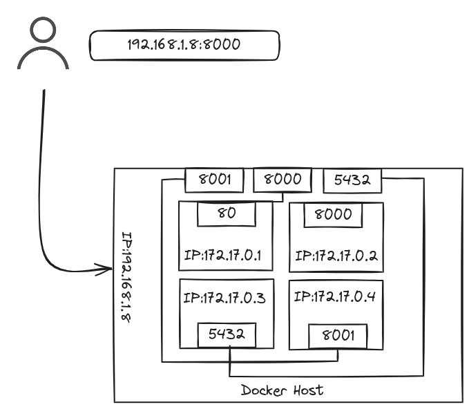

## O que é DevOps?


*De modo geral podemos compreender **DevOps** como uma **cultura** que tem como premissa unir os times de Operações e Desenvolvimento.*

---
## Cultura DevOps

 - Integração contínua;
 - Entrega contínua;
 - Microsserviços;
 - Infraestrutura como código;
 - Monitoramento e observabilidade;
 - Comunicação e colaboração;
 - ....

---
## Containers x VM's:

### Considere o seguinte caso:


Dependency Hell

---
## Containers x VM's:
### Estrutura de uma VM


---
## Containers x VM's:
### Estrutura de um container


---
## Containers x VM's:
### Uma comparação

|                        | VM         | Container   |
| ---------------------- | ---------- | ----------- |
| Tamanho                | GB         | MB          |
| Boot                   | Minutos    | Segundos    |
| Utilização de recursos | Média/alta | Baixa/Média |

---
## Por que Docker é importante em DevOps?

- Compatibilidade;
- Agilidade;
- Portabilidade;
- Isolamento.

---

## Prática

---
### Primeiros comandos

 Comandos básicos: Iniciar um container
 
 ```
 docker run
 ```

 

---
### Primeiros comandos

Comandos básicos: Listar containers
 
 ```
 docker ps
 ```


---
### Primeiros comandos

Comandos básicos: Parar containers
 
 ```
 docker stop $(container_name)
 ```
---
### Primeiros comandos

Comandos básicos: excluir containers
 
 ```
 docker rm $(container_name)
 ```
 ---

### Docker run

#### Tag

Maneira de versionarmos imagens docker
```
docker run nginx:latest
docker run nginx:1.26.2
```
A TAG **latest** é aplicada toda vez que geramos uma imagem sem especificar a tag.

---
### Docker run
#### STDIN

```
docker run -i $(image_name)
```
```
docker run -it $(image_name)
```

---
### Docker run
#### Port Mapping


```
docker run -p 80:8000 $(image_name)
```

---

#### Volumes


```
docker run -v /opt/dockerhost-path:/var/lib/mysql $(image_name)
```

---

# Ficamos por aqui!

- Criar conta no DockerHub;
- Explorar imagens que achem bacana


**Dúvidas ou sugetões?**

---