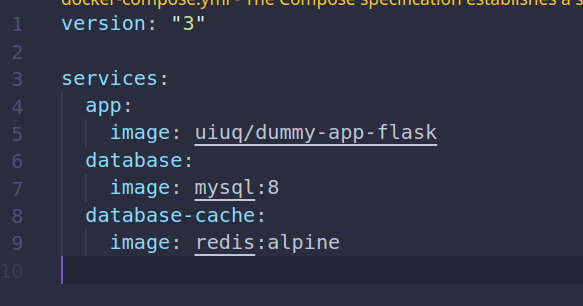
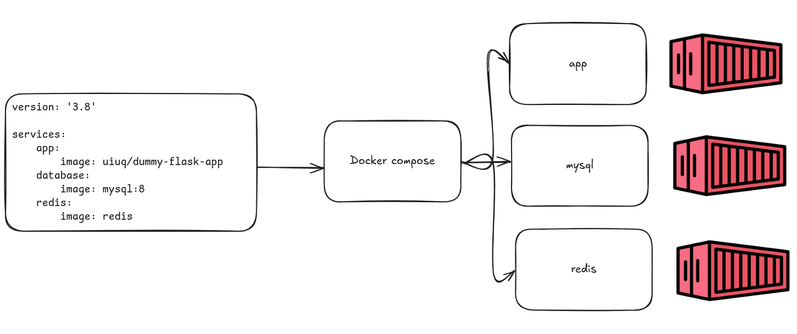

## O que é?

Podemos definir o [docker compose](https://docs.docker.com/compose/) como um **orquestrador** de containers.


---
## O que é orquestração de containers?

O processo de ***automatização*** de deployments, gerenciamento, escalonamento e redes de containers durante seu ciclo de vida.

---
## O que o orquestrador resolve?

Exemplo se quisermos fazer o run de muitos containers manualmente:
```
docker run $(image_name)
docker run $(image_name0)
docker run $(image_name1)
```

---

## O que o orquestrador resolve?

- Provisionamento e deployment;
- Configuração e agendamento;
- Alocação de recursos;
- Disponibilidade;
- Escalonamento;
- Balanceamento roteamento de tráfego;
- Monitoramento e garantia de health;

---

## Exemplo de configuração




---
## Exemplo 



---
## Comando básicos docker compose
Para iniciar todos os serviços definidos no compose.yaml:
```
docker compose up
```
---
## Comando básicos docker compose
Para parar e excluir todos os serviços rodando:
```
docker compose down
```
---
## Comando básicos docker compose
Para visualizar logs dos serviços que estão em execução:
```
docker compose logs
```
---
## Comando básicos docker compose
Listar serviços e seu status:
```
docker compose ps
```
---

## Prática

---
## Clonar algum projeto deste repo
- [Docker Samples](https://github.com/dockersamples)

Exemplo: https://github.com/dockersamples/example-voting-app

---
# Ficamos por aqui!

**Dúvidas ou sugetões?**

---