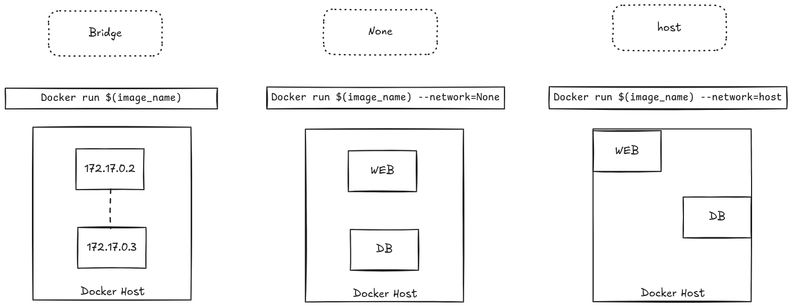
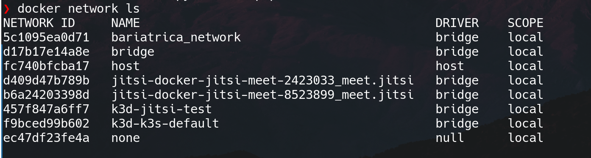
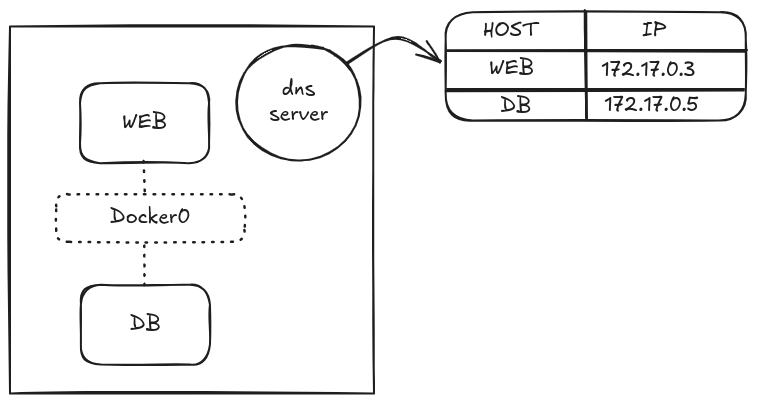

## Como o docker configura redes



---
## Consigo configurar minhas redes?

- SIM!

```
docker network create \
	---driver $(selected_driver) \
	--subnet $(selected_subnet_block) 
	$(network_name)
```
---
## Inspecionando redes


---
## Resolução de nomes Docker



---

# Ficamos por aqui!

**Dúvidas ou sugetões?**

---