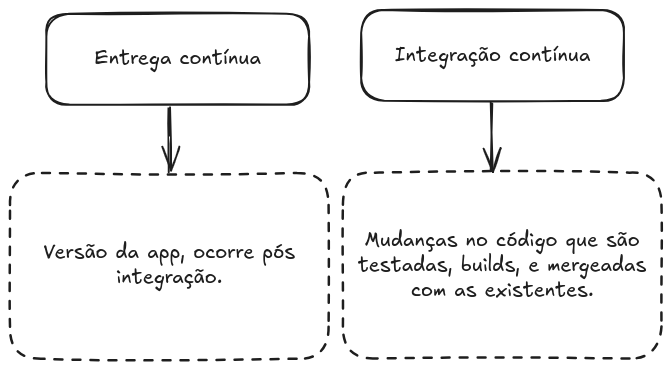
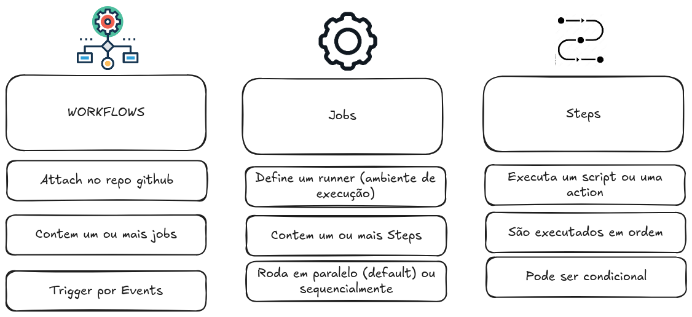
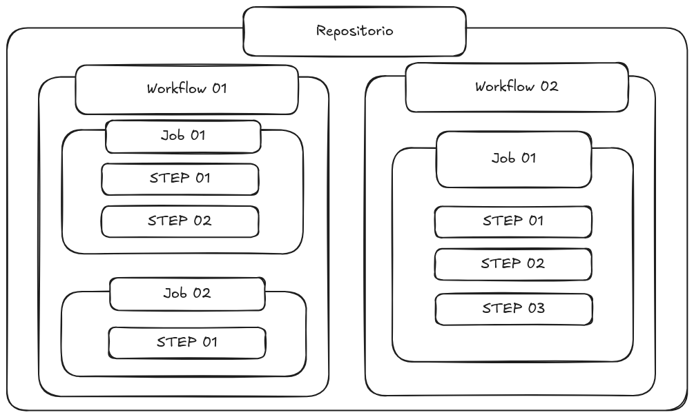

## O que é?

GitHub Actions é uma plataforma de integração e entrega contínua (CI/CD) que permite automatizar a sua compilação, testar e integrar sua pipeline de implantação. É possível criar fluxos de trabalho que criam e testam cada pull request no seu repositório, ou implantar pull requests mesclados em produção.

---
## CI/CD

---
## Visualizando

De maneira geral podemos seguir essa seguinte estrutura.

---
## O que compõe github actions

---
## Como é configurada?

Exemplo da action utilizada para servir esse material:
https://github.com/uiuqM/treinamento-devops-epic/blob/main/.github/workflows/main.yaml

---
## Visualizando

---
## Pratica

- https://github.com/treinamento-devops-playground

---
## Events (Workflow triggers)

| Relacionado ao repositório                  | Outros                                          |
| ------------------------------------------- | ----------------------------------------------- |
| push (commit)                               | workflow_dispatch (trigger manual)           |
| pull_request (opened, closed...)            | repository_dispatch (REST API)               |
| create (branch ou tag)                      | scheduled (Workflow agendado)                |
| fork (repo teve fork)                       | workflow_call (Chamado por outros workflows) |
| issues (issue aberta, deletada....)         |                                                 |
| issues_comment (issue ou PR comment)        |                                                 |
| watch (repo favoritado)                     |                                                 |
| discussion (dicussion criada, deletada ...) |                                                 |
| ....                                        |                                                 |

---

## Job runners

---
## Actions

Uma aplicação que performa uma tarefa (complexa) repetitiva.

Exemplos:
https://github.com/actions/checkout
https://github.com/marketplace?type=actions
---

# Ficamos por aqui!

**Dúvidas ou sugetões?**

---