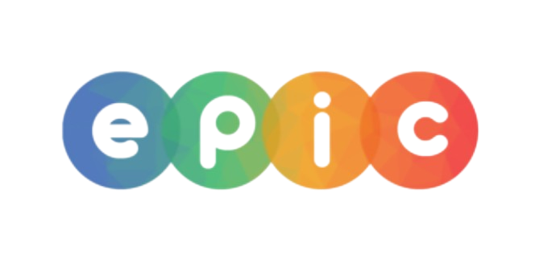

## Professor: Edeilson Milhomem da Silva
## Instrutor: Wilque Muriel do N. Coelho

---

# Estrutura e Objetivos do Treinamento: Introdução a DevOps com Docker e GitHub Actions

---
## Objetivo Geral

Capacitar os participantes nos conceitos básicos de DevOps, com ênfase em ferramentas essenciais como Docker e GitHub Actions, para que possam implementar práticas de automação, integração e entrega contínua em projetos de software.

---

### Estrutura do Treinamento

O treinamento está dividido em 5 dias, com aulas teóricas e práticas que abordam os principais conceitos e ferramentas de DevOps. Cada dia tem duração de aproximadamente 3 horas.

---

## Dia 1: Fundamentos de DevOps e Introdução ao Docker

 - Objetivo: Apresentar os conceitos básicos de DevOps e iniciar o uso do Docker.

 - O que é DevOps?

 - Cultura DevOps (CI/CD, automação, colaboração).

 - Introdução a containers e Docker.

 - Comandos básicos do Docker: docker run, docker ps, docker images, docker stop.

 - Prática: Rodando o primeiro container (hello-world).

---

## Dia 2: Trabalhando com Docker e Dockerfiles

 - Objetivo: Construir e personalizar containers usando Dockerfiles.
 
 - Estrutura de um Dockerfile.
 
 - Comandos principais: FROM, RUN, COPY, CMD.
 
 - Prática: Criando uma imagem personalizada para uma aplicação Flask.
 
 - Mapeamento de portas e volumes.

---

## Dia 3: Integração com GitHub e Introdução ao GitHub Actions

 - Objetivo: Configurar workflows simples de automação no GitHub Actions.
 
 - Revisão de Git e GitHub.
 
 - O que é GitHub Actions?
 
 - YAML: configuração de workflows.
 
 - Prática: Criar um workflow para rodar testes automáticos em push/pull requests.

---

## Dia 4: Integração Docker + GitHub Actions

 - Objetivo: Automatizar a criação e publicação de imagens Docker usando GitHub Actions.
 
 - Usando Docker no GitHub Actions.
 
 - Configuração de secrets no GitHub.
 
 - Prática: Criar workflows para construir e publicar imagens Docker no Docker Hub.

---

## Dia 5: Projeto Prático Final

 - Objetivo: Consolidar o aprendizado com um projeto prático que integra Docker e GitHub Actions. 

 - Desenvolvimento de uma aplicação simples.

 - Configuração de workflows para CI/CD completo.

 - Publicação de imagens Docker.

 - Apresentação dos resultados pelos participantes.

---

## Resultados Esperados

### Ao final do treinamento, espera-se que os participantes sejam capazes de:

 - Compreender os fundamentos de DevOps e sua importância no ciclo de desenvolvimento.

 - Utilizar Docker para criar, configurar e gerenciar containers.

 - Criar workflows automatizados no GitHub Actions.

 - Integrar Docker e GitHub Actions para automação de CI/CD.

 - Aplicar os conhecimentos adquiridos em projetos reais de desenvolvimento.